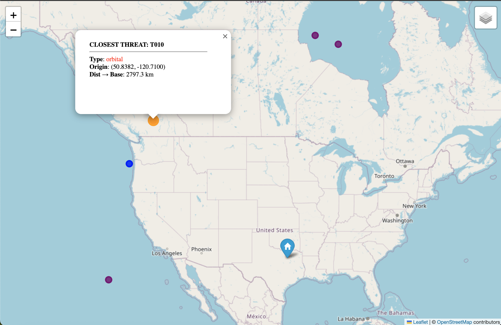
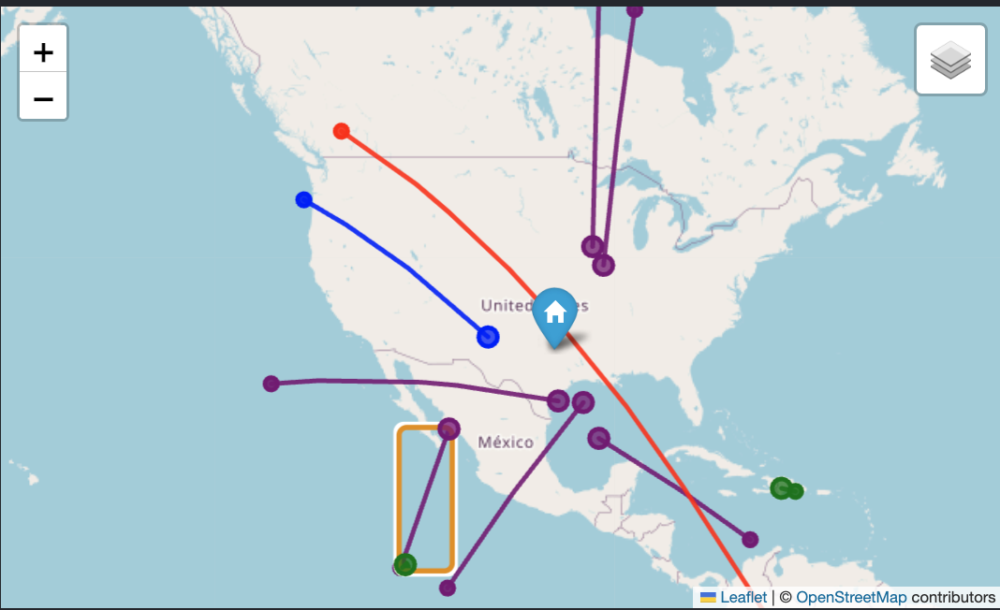
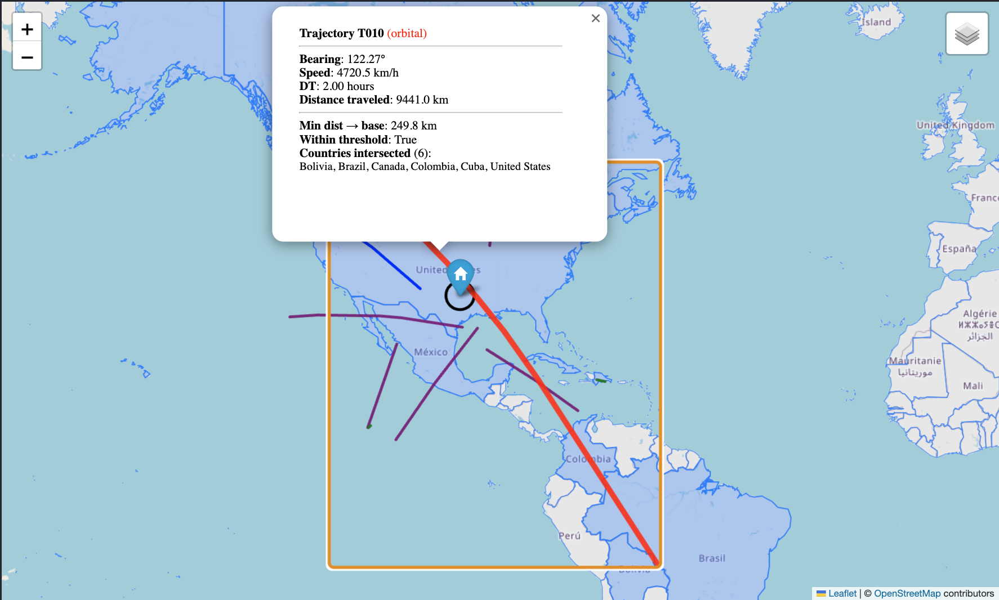
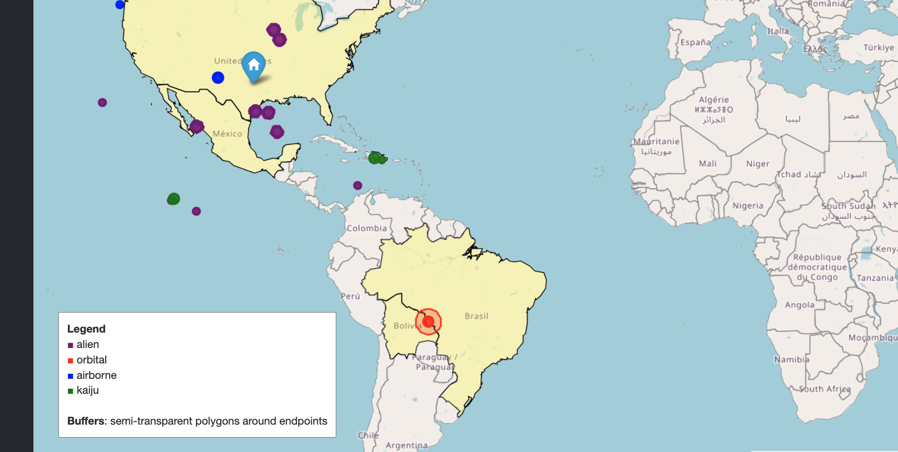

# Project 01 — Missile Geometry 101 (World Defense Organization)

This project is a spatial analysis exercise focused on geometry, not realism.  
Using simulated threat data, I built geospatial representations (points, lines, polygons) to analyze:

- where threats originate,
- where they travel over time,
- which national borders they intersect,
- whether they pass dangerously close to the base, and
- which countries fall inside “damage zones” around predicted impact areas.

Tools used: **Python, GeoPandas, Shapely, Folium** (no databases, no real-time simulation).

---

## Project Structure (What’s in this folder)

- `notebook.ipynb` — main notebook (Milestones 1–5)
- `src/` — provided helper modules (geo math, IO, mapping helpers, threat simulation)
- `data/` — world borders + threats
- `outputs/`
  - `map_m2.html`, `map_m3.html`, `map_m4.html`, `map_m5.html` — generated interactive maps
  - `m5_damage_table.csv` — Milestone 5 output dataset (reused in Project 02)
  - `screenshots/` — required screenshots for each milestone

---

# Milestones

## Milestone 1 — Plot the World
**Goal:** Load world boundaries and display the fixed base location.

Screenshot:  

What this demonstrates:
- World borders loaded successfully
- Base marker is visible and map interaction (zoom/pan) works

---

## Milestone 2 — Distance & Threat Origins
**Goal:** Compute distance from each threat origin to the base, identify the closest threat, and map all threat origins.

Outputs:
- Interactive map: `outputs/map_m2.html`
- Screenshot:  
  

What this demonstrates:
- Numeric spatial reasoning (distance to base)
- Threat attributes are inspectable and visualized on the map

---

## Milestone 3 — Trajectories (Point → LineString)
**Goal:** Convert motion into geometry.

Method:
- For each threat, compute a destination point after a fixed time interval
- Generate intermediate points
- Build a `LineString` trajectory
- Plot origins, trajectories, and endpoints

Outputs:
- Interactive map: `outputs/map_m3.html`
- Screenshot:  
  

Visual expectations met:
- Threat start locations are visible (origins)
- Threat heading/paths are visible (lines and endpoints)
- Different bearings produce different directions, and different speeds produce different trajectory lengths (for the same time interval)

---

## Milestone 4 — Intersections & Borders
**Goal:** Determine what threats interact with.

Method:
- `intersects`: identify which country polygons each trajectory crosses
- distance threshold: compute minimum distance from each trajectory to the base
- visually highlight intersected countries and emphasize “danger close” trajectories

Outputs:
- Interactive map: `outputs/map_m4.html`
- Screenshot:  
  

What this demonstrates:
- Spatial relationship queries (`intersects`, distance-to-base threshold)
- Threat-to-country interactions are visible and verifiable

---

## Milestone 5 — Damage Zones (Buffers)
**Goal:** Prepare data for Project 02 by generating threat impact zones.

Method:
- Create a buffer around each trajectory endpoint
- Buffer size depends on `threat_type`
- Determine which countries intersect each buffer
- Output a reusable dataset of affected countries + severity

Outputs:
- Interactive map: `outputs/map_m5.html`
- Output dataset: `outputs/m5_damage_table.csv`
- Screenshot:  
  

Table format (example):
- `country, threat_id, threat_type, severity, buffer_km`

---

# Reflection (What I Learned)

## What surprised me
The biggest surprise was how quickly “motion” becomes understandable once it’s represented as geometry (LineStrings and buffers). Even without animation, trajectories + endpoints make threat behavior easy to interpret visually.

## What broke
The main issues were environment/kernel mismatches (missing packages in the notebook kernel) and data formatting assumptions (JSON structure differences). Once the correct kernel and parsing were fixed, everything became much smoother.

## What suddenly clicked
Once I treated threats as geometry objects:
- points for origins/endpoints,
- lines for trajectories,
- polygons for countries/buffers,  
then the core questions became straightforward: **intersects()** and **distance()** were enough to answer most of the analysis goals.

---

